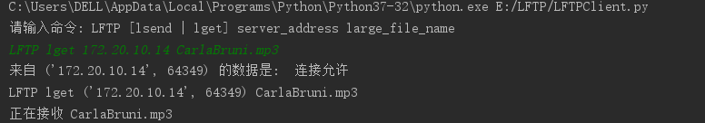

# LFTP

Computer Networks Midterm Project

A network application, LFTP, to support large file transfer between two computers in the Internet.

[TOC]


## 运行环境

Python 3.7

PyCharm IDE


## 文件描述

* `LFTPServer.py` LFTP服务端
* `LFTPClient.py` LFTP客户端


## 文件夹描述

收发的文件放在下面的两个文件夹。运行时若以下两个文件夹不存在，则自动建立：

 * `ServerFiles` 服务端(要接收或发送)的文件存放在ServerFiles
 * `ClinetFiles` 客户端(要接收或发送)的文件存放在ClientFiles

其中， 要传输的文件命名不能有空格和`#`


 ## LFTP协议数据包格式

#### 发送端向接收端发送的数据包格式

使用python的`struct`模块打包数据，形成LFTP数据包发送

定义`pkt_struct = struct.Struct('II1024s')`

数据包格式:

 * `seq` int类型。序列号。
 * `end_flag` int类型。文件结束标志，为`1`时表示文件发送完毕，即最后一个文件分组。
 * `data` 1024字节的byte类型。文件分组。

发送文件时，文件以1024字节长度来分组，设分组数为`N`，这些分组所在的数据包的序列号为`0`到`N-1`。

其中，发送最后一个分组时，数据包中`end_flag`被置为`1`。

#### 接收端向发送端ACK的数据包格式

收到一系列数据包后，接收到向发送端发送ACK，ACK的内容是`need_ack`，是期望收到的下一个数据包的序列号。同时表明，接收端里序列号为`0 ~ need_ack-1`的数据包已经正确收到。


 ## 支持同时多客户端文件收发

使用python3的`threading`模块，用多线程的方法，支持同时多客户端文件收发。

服务端运行时，会创建服务端主socket，`server_main_socket`，绑定端口`12000`，监听客户端的请求。

客户端向服务端的`12000`端口号发送连接请求。服务端收到该请求后，创建新的服务端线程，处理对应客户的请求。在服务端这个新的线程中，会创建新的`server_socket`，这个`server_socket`也有新的端口号。

比如产生的新`server_socket`端口号为52345，服务端向客户端发送“连接允许”数据包，客户端调用`message, server_address = client_socket.recvfrom(BUF_SIZE)`收到这个“连接允许”数据包，这里的`server_address`元组被更新为`(服务端ip, 52345)`。

服务端监听客户端请求：

```python
while True:
    print('正在运行的线程数量：', threading.activeCount())
    # 服务端主socket等待客户端发起连接
    print("等待客户端发起连接...")
    while True:
        try:
            message, client_address = server_main_socket.recvfrom(BUF_SIZE)
            break
        except socket.timeout as e:
            continue
    print('来自', client_address, '的数据是: ', message.decode('utf-8'))

    # 创建新的线程，处理客户端的请求
    address.append(client_address)
    new_thread = threading.Thread(target=serve_client, args=(client_address, message))
    new_thread.start()
```

收到客户端请求后，服务端创建新线程，在`serve_client`函数里做进一步处理。

* 客户端的请求为`lget`

  如果要下载的文件不在服务端文件夹`ServerFiles`，则告知客户端，向客户端发送`fileNotExists`报文，断开连接。客户端会收到该提示。

  如果要下载的文件存在，则向客户端发送”连接允许“报文。此时服务端等待客户端`ACK`，服务端收到后，调用`lget`函数，开始向客户端发送文件。

* 客户端的请求为`lsend`

  服务端向客户端发送“连接允许”报文。此时服务端等待客户端`ACK`，服务端收到后，调用`lsend`函数，开始接收来自客户端的文件


## 可靠数据传输

以客户端下载文件(`lget`)为例（反之`lsend`亦然）。

* 首先，接收数据包时，设置模拟丢包：

    ```python
    # 开始接收数据包
    while True:
        buffer_receive = []
        # 用缓冲区接收数据包
        package_num = 0
        while len(buffer_receive) <= RCV_WINDOW_SIZE:
            try:
                packed_data_, server_address_ = client_socket.recvfrom(BUF_SIZE)
                if package_num > 600 and random.randint(0, 100) > 96:    # 模拟丢包
                    continue
                buffer_receive.append(packed_data_)
                package_num += 1
            except Exception as e:
                print(sys._getframe().f_lineno, e)
                break
    ```

    为了应对丢包的情况，客户端在接收缓存里取出数据包来写入文件时，根据数据包的序列号，如果收到了乱序的数据包（即`seq_num != need_ack`，数据包序列号不等于期望收到的数据包序列号），则停止写入文件，将接收缓存里的数据包丢弃，向服务端发送`need_ack`，是期望收到的数据包序列号。

    服务端收到这个`need_ack`后，将`need_ack`赋值给`send_base`，开始下一轮发送。

* 发送ACK时，设置模拟ACK丢包，ACK的数据包有几率发送到`dummy_address`，这是一个随便设的地址`dummy_address = ('150.10.10.2', 65351)`

    ```python
    if random.randint(0, 99) > 90:  # 模拟ACK丢包
        client_socket.sendto(str(need_ack).encode('utf-8'), dummy_address)
    else:
        client_socket.sendto(str(need_ack).encode('utf-8'), server_address)
    ```

    若ACK发送到了`dummy_address`，服务端收不到ACK数据包。若服务端超时，`send_base`不变，重新向客户端发送数据包。若服务端收到了另一个ACK，将`need_ack`赋值给`send_base`，开始下一轮发送。


## 流水线传输

### 对于接收端

1. 每轮接受会新建一个列表，用于存放接收到的包

   ```python
   # 用缓冲区接收数据包
   buffer_receive = []
   package_num = 0
   while len(buffer_receive) <= RCV_WINDOW_SIZE:
       try:
           packed_data_, client_address_ = server_socket.recvfrom(BUF_SIZE)
           buffer_receive.append(packed_data_)
           package_num += 1
   ```

2. 当缓存满了之后，就会向发送端发送已经满了的信号

   ```python
   if package_num != 0:
       print(sys._getframe().f_lineno, "full")
       server_socket.sendto('isFull'.encode('utf-8'), client_address)
   ```

3. 开始从缓存里读收到的包，通过判断seq和下一个需要的数据段的起始位置是否相同，判断是否写入文件里，如果不同，则直接丢包

   ```python
           while len(buffer_receive) > 0:
               data_ = buffer_receive[0]
               unpacked_data = pkt_struct.unpack(data_)
               seq_num = unpacked_data[0]
   
               ...# 可靠性处理
               
               end_flag = unpacked_data[1]
               data = unpacked_data[2]
               buffer_receive.remove(data_)
               if seq_num == need_ack:
                   if end_flag != 1:
                       file_to_recv.write(data)
                       need_ack += 1
                   else:
                       need_ack += 1
                       break  # 结束标志为1,结束循环
   ```

4. 在将缓存清空后，发送一个下一个需要的位置的包给发送端

   ```py
    server_socket.sendto(str(need_ack).encode('utf-8'), client_address)
   ```

### 对于发送端

1. 每轮从文件中读取发送窗口大小数量的包

   ```python
   data_group = []
   for i in range(SND_WINDOW_SIZE):
   	data_group.append(file_to_send.read(FILE_BUF_SIZE))
   	if str(data_group[len(data_group) - 1]) == "b''":
   		break
   ```

2. 然后每轮发送一定数量的包（这在拥塞控制里体现）

   ```python
   for i in range(cwnd):
   
       ... # 可靠性设置
   
       if str(data_group[i]) != "b''":  # b''表示文件读完
           end_flag = 0
           client_socket.sendto(pkt_struct.pack(*(pkt_count+i, end_flag, data_group[i])), server_address)
           send_package_num += 1
   ```

3. 同时，有一个线程用于监听接收端是否发出缓存满了的包，如果监听到，就让发送包的线程停止发送，并结束这个监听线程，开始监听对方传来的ACK包

   ```python
   def listen_package(client_socket, ack_type):
       global is_full
       is_full = False
       if ack_type == 0:
           # 循环接收，直到传输结束
           while not is_exit:
               try:
                   ack_data_, server_address = client_socket.recvfrom(BUF_SIZE)
                   if str(ack_data_.decode('utf-8')) == "isFull":
                       is_full = True
                   break
               except socket.timeout as e:
                   threading_lock.acquire()
                   if is_exit:
                       threading_lock.release()
                       break
                   else:
                       threading_lock.release()
   ```

4. 当收到对方发来的ACK包，将下一轮开始发送的位置置为对方发来的ACK的数值，如果出现超时的情况，则重新发送这一轮发送的包（将下一轮开始发送位置置为这一轮开始位置）

   ```python
   try:
       ack_data_, server_address = client_socket.recvfrom(BUF_SIZE)
       while True:
           get_data = str(ack_data_.decode('utf-8'))
           if get_data.isdigit():
               ack_num = int(get_data)
               print(sys._getframe().f_lineno, "ack_num", ack_num)
               pkt_count = ack_num
               break
           else:
               cwnd = 1
               pkt_count = pkt_count
               ack_data_, server_address = client_socket.recvfrom(BUF_SIZE)
   ```

5. 遍历包的list，如果里面有接收端已经接收到的包则删除，然后继续读文件，直到list里的包的数量等于发送最大窗口的大小

   ```python
   for i in range(pkt_count - send_base):
       del data_group[0]
   while len(data_group) < SND_WINDOW_SIZE:
       data_group.append(file_to_send.read(FILE_BUF_SIZE))
       if str(data_group[len(data_group) - 1]) == "b''":
           break
   ```


## 流量控制

1. 接收端的不断将收到的数据包放入缓存中时，当缓存满了，就会将后面发的包丢掉，并向发送端发送缓存满了的信号

   ```python
   if package_num != 0:
       print(sys._getframe().f_lineno, "full")
       server_socket.sendto('isFull'.encode('utf-8'), client_address)
   ```

2. 而当发送方接收到缓存满了的信号，就会停止发送，等待接收端的ACK

   ```python
   # 监听线程
   ack_data_, server_address = client_socket.recvfrom(BUF_SIZE)
   if str(ack_data_.decode('utf-8')) == "isFull":
       is_full = True
   break
   
       # 发送线程
   if is_full or pkt_count == len(data_group) - 1 or i >= len(data_group):
       break
   ```


## 拥塞控制

拥塞控制是在发送端设置的

1. 设初始的cwnd为1，每轮发送的数量设为cwnd（其中cwnd最大不超过发送窗口大小）。

   ```python
   # cwnd的值
   cwnd = 1
   
   # 发送不超过发送窗口通过 
   #1.读文件只读窗口大小的内容；
   #2.发送数据包的时候，遇到超出窗口大小就break
   if is_full or pkt_count == len(data_group) - 1 or i >= len(data_group):
       break
   ```

2. 每发送一轮则让cwnd等于上一轮的两倍。

   ```python
   cwnd *= 2
   ```

3. 如果遇到超时和丢包的情况，则将cwnd置为1

   ```python
   except socket.timeout as e:
       pkt_count = pkt_count
       cwnd = 1
   ```


## 运行情况（截图）

#### 运行服务端

运行服务端`LFTPServer.py`，等待客户端发起连接


#### 运行客户端

运行服务端`LFTPClient.py`，提示输入命令：


若命令输入有误，输出提示并退出程序：


#### 客户端发送lsend命令

* （客户端）若要发送的文件不在`ClientFiles`文件夹内，输出提示并退出程序：


* （客户端）向服务端(`172.20.10.14`)请求上传`1.mp4`文件，收到服务端“连接允许”后，向服务端发送`ACK`，收到服务端“接收允许”后，开始发送文件：


* （服务端）收到来自客户端(`172.20.10.2`)的请求，向客户端发送“连接允许”，然后收到客户端的`ACK`后，向客户端发送“接收允许”，开始接收文件：

  

* （服务端）接收完毕，关闭(close)当前线程的socket

  

#### 客户端发送lget命令

* （客户端）若要下载的文件不在服务端的`ServerFiles`文件夹内，服务端向客户端发送`fileNotExists`报文，客户端收到后，输出提示并退出程序：

  

* （客户端）向服务端(`172.20.10.14`)请求下载`CarlaBruni.mp3`文件，收到服务端“连接允许”后，向服务端发送`ACK`，开始接收文件：

  

* （服务端）收到来自客户端(`172.20.10.2`)的请求，向客户端发送“连接允许”，然后收到客户端的`ACK`后，开始发送文件：

  

* （服务端）成功发送文件，关闭(close)当前线程的socket：

  